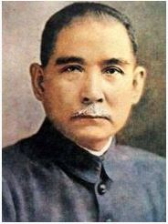
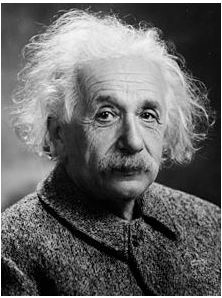
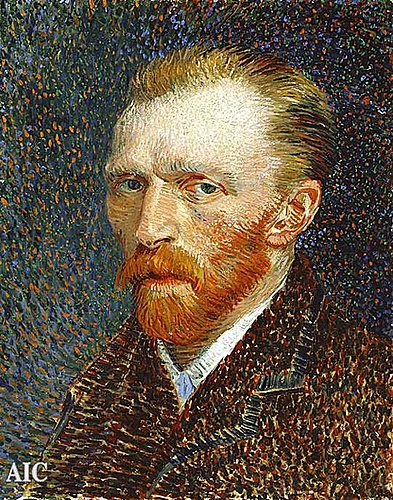
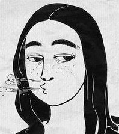
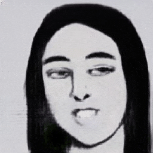

# ET082_15_MoveImg

## Slide

- Please download [here](https://drive.google.com/file/d/1FGjP9OPkHeKwyj_DjDxJGtAIlZacOn3V/view?usp=sharing)
- 2020/01/17 AIA南部分校 AI meetup

## Framework
- pytorch >= 1.2
- tensorflow == 2.0 (optional)
- face-alignmemt

## File Structure

### / tf2
- 2019/10/16
- data preprocessing
- try tensorflow 2.0 for building model
- not well-trained

### / torch
- 2019/11/2
- pytorch for building model
- training for **meta** stage

### / finetune (non-public)
- 2019/11/15
- training for **fine-tune** stage
- generate `.gif` result (moving image)
- NOTE: **In this fine-tune stage, model training is co-worked with team effort. So codes in this stage are non-public.** 

### / result
- put partial results for demo 

## Code Structure

### Data Source
- VoxCeleb1 dataset
- Raw data from link: http://www.robots.ox.ac.uk/~vgg/data/voxceleb/
- or download from http://www.robots.ox.ac.uk/~vgg/research/CMBiometrics/data/dense-face-frames.tar.gz (~27GB)

## Reference

- paper: [Few-Shot Adversarial Learning of Realistic Neural Talking Head Models](https://arxiv.org/pdf/1905.08233.pdf)

- code: 
    1. https://github.com/grey-eye/talking-heads
    2. https://github.com/vincent-thevenin/Realistic-Neural-Talking-Head-Models
    3. https://github.com/shoutOutYangJie/Few-Shot-Adversarial-Learning-for-face-swap